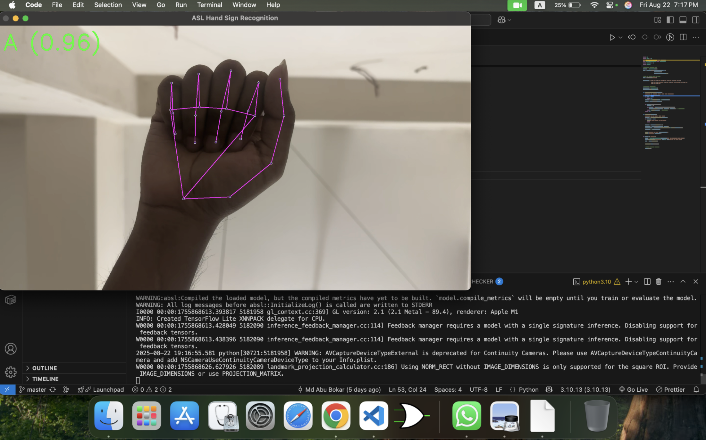

# Hreco - Hand Sign Recognition



Welcome to the **Hreco** project! This README provides an overview of the project, setup instructions, and other relevant details.

## Table of Contents

- [Visit](#visit)
- [About](#about)
- [Features](#features)
- [Installation](#installation)
- [Structure](#structure)
- [Contributors](#contributors)
- [Contributing](#contributing)
- [License](#license)

## Visit

- [Repository](https://github.com/aabubokarr/hreco)

## About

**Hreco** focuses on leveraging machine learning techniques to solve the communication gap between those who don't know sign language and those who uses sign language. The aim is to translate sign language into text using a trained deep learning model.

## Features

- Hand Landmark Extraction
- ASL Hand Sign Recognition
- Image-based Prediction
- Real-time Prediction via Webcam

## Installation

1. Clone the repository:
    ```bash
    git clone https://github.com/aabubokarr/hreco.git
    ```
2. Navigate to the project directory:
    ```bash
    cd hreco
    ```
3. Install dependencies:
    ```bash
    python -m venv .venv
    source .venv/bin/activate

    python -m pip install --upgrade pip
    python -m pip install -r requirements.txt
    ```
4. Run Real-time Recognition:
    ```bash
    python main.py
    ```

## Structure

```
hreco/
├── test/                   # Images for testing the model
│   ├── a.jpeg
│   ├── b.jpg
│   ├── c.jpg
│   ├── ...
│   └── z.jpg
├── .gitignore              # Git ignored files and folders
├── asl.h5                  # Trained model
├── class_names.npy         # ASL class names
├── LICENSE                 # MIT License file
├── main.py                 # Real-time ASL recognition using webcam
├── README.md               # Project documentation
├── requirements.txt        # Python dependencies
├── test.py                 # Test model predictions
├── train.py                # Train the ASL recognition model
├── X.npy                   # Extracted feature data
└── y.npy                   # Corresponding labels
```

## Contributors

<p align="center">
  <a href="https://github.com/aabubokarr/hreco/graphs/contributors">
    
  </a>
</p>

## Contributing

Contributions are welcome! Please follow these steps:

1. Fork the repository.
2. Create a new branch:
   ```bash
   git checkout -b feature-name
   ```
3. Commit your changes:
   ```bash
   git commit -m "Add feature-name"
   ```
4. Push to the branch:
   ```bash
   git push origin feature-name
   ```
5. Open a pull request.

## License

This project is licensed under the [MIT License](LICENSE).
